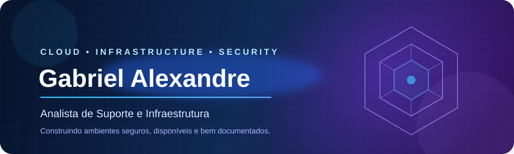

<div align="center">



<br/>

[](https://github.com/Gabriel-F4l)


</div>

## Olá, eu sou o Gabriel 👋

Sou profissional de Tecnologia da Informação com experiência em **suporte técnico, infraestrutura corporativa, ambientes Microsoft, redes e troubleshooting**.

Minha trajetória está direcionada para **Cloud Infrastructure & Security**. Uso este espaço para transformar estudos e desafios técnicos em laboratórios práticos, automações e documentação que demonstram meu desenvolvimento profissional.

<table>
<tr>
<td width="50%" valign="top">

### O que faço hoje

- Suporte remoto e presencial
- Administração de Microsoft 365
- Active Directory e Microsoft Entra ID
- Microsoft Intune e endpoints Windows
- Monitoramento com Zabbix e Grafana
- Diagnóstico de redes, VPNs e aplicações
- Automação e coleta de evidências com PowerShell

</td>
<td width="50%" valign="top">

### Para onde estou evoluindo

- Cloud Security no Microsoft Azure
- Segurança de identidades e endpoints
- Monitoramento e resposta a incidentes
- Infraestrutura como código e automação
- Redes corporativas e arquitetura cloud
- Certificações Microsoft Security e Cisco
- Carreira como Cloud Security Engineer

</td>
</tr>
</table>

## Stack técnica

<div align="center">

### Cloud e ecossistema Microsoft


### Redes, monitoramento e automação


</div>

## Certificações

<div align="center">


</div>

## Projetos em destaque

<table>
<tr>
<td width="50%" valign="top">

### ☁️ [Azure Enterprise Lab](https://github.com/Gabriel-F4l/Azure-Enterprise-Lab)

Laboratório de infraestrutura corporativa no Microsoft Azure, organizado para explorar:

- Redes e segmentação
- Microsoft Entra ID e RBAC
- Monitoramento e governança
- Segurança e controle de custos
- Documentação de arquitetura

[](https://github.com/Gabriel-F4l/Azure-Enterprise-Lab)

</td>
<td width="50%" valign="top">

### 🌐 [SuperTech Network Lab](https://github.com/Gabriel-F4l/packet-tracer-lab)

Laboratório empresarial criado no Cisco Packet Tracer com:

- VLANs e endereçamento IPv4
- DHCP e DNS
- Roteamento
- ACLs e controle de tráfego
- Troubleshooting de conectividade

[](https://github.com/Gabriel-F4l/packet-tracer-lab)

</td>
</tr>
</table>

## GitHub em números

<div align="center">


</div>

<div align="center">


</div>

## Próximos passos

```text
[em andamento]  Aprofundar Azure e Cloud Security
[planejado]     Microsoft Security Fundamentals — SC-900
[planejado]     Azure Administrator — AZ-104
[planejado]     Security Operations Analyst — SC-200
[objetivo]      Cloud Infrastructure & Security Engineer
```

---

<div align="center">

### “Segurança não é apenas uma ferramenta — é parte da arquitetura.”

Projetos práticos • Aprendizado contínuo • Documentação técnica

</div>
